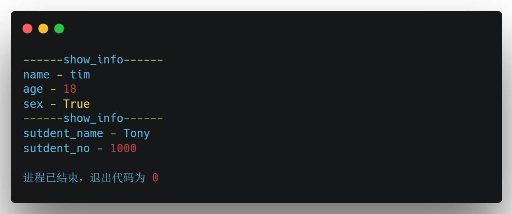
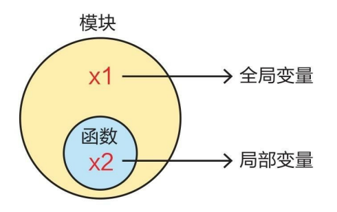
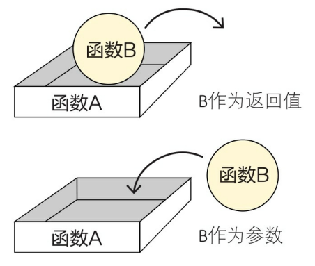

# 七、函数

可以使用函数来封装。函数具有函数名、参数和返回值。python中的函数很灵活：可以在模块中但是类之外定义，作用域是当前模块，我们称之为函数；也可以在别的函数中定义，我们称之为嵌套函数；haikeyizai类中定义，我们称之为方法。

## 1.定义函数

自定义函数的语法格式如下：


由于定义函数时的参数不是实际数据，会在掉用函数时传递给他们实际数据，所以称定义函数时的参数为**形式参数**，简称**形参**。称调用函数时传递的实际数据为**实际参数**，简称**实参**。可以将形参理解为在函数中定义的变量。

```python
# coding=utf-8

def rect_area(width,height):
    area = width * height
    return area

def print_area(width, height):
    area = width * height
    print("{0} * {1} 长方形的面积：{2}".format(width, height, area))
```

## 2.调用函数

### 2.1 使用位置参数调用函数

在调用函数时传递的实参与定义函数时的形参顺序一致，这是调用函数的基本形式。

```python
# coding=utf-8

def rect_area(width, height):
    area = width * height
    return area

r_area = rect_area(123, 456) #实参列表，顺序与形参一致
print("{0} * {1} 长方形的面积：{2:0.2f}".format(123, 456, r_area))
```

### 2.2 使用关键字参数调用函数

在调用函数时可以采用“关键字=实参”的形式，其中，关键字的名称就是定义函数时形参的名称。

```python
# coding=utf-8

def rect_area(width, height):
    area = width * height
    return area

r_area = rect_area(width=123, height=456) #关键词的名称就是定义函数时的形参的名称 
print("{0} * {1} 长方形的面积：{2:0.2f}".format(123, 456, r_area))
r_area = rect_area(height=456, width=123) #实参不在受形参的顺序限制
print("{0} * {1} 长方形的面积：{2:0.2f}".format(123, 456, r_area))
```

## 3.参数的默认值

在python中没有函数重载的概念，而是为函数的参数提供默认值实现的。

```python
# coding=utf-8
def make_coffee(name="卡布奇诺"): #默认值
    return "制作一杯{0}咖啡。".format(name)
coffee1 = make_coffee("拿铁") #提供参数
coffee2 = make_coffee() #没有提供参数，使用默认值
print(coffee1)  # 制作一杯拿铁咖啡。
print(coffee2) # 制作一杯卡布奇诺咖啡。
```

结果：


## 4.可变参数

python中的函数可以定义接受不确定数量的参数。可变参数有两种，即在参数前加`*`或`**`.

### 4.1 基于元组的可变参数（*可变参数）

*可变参数在函数中被组装成一个元组。

```python
# coding=utf-8
def sum(*numbers): #可变参数
    total = 0.0
    for number in numbers:
        total += number
    return total
print(sum(100.0, 20.0, 30.0)) #多个参数被组装成元组numbers
print(sum(30.0, 80.0))
```

结果：


### 4.2 基于字典的可变参数（**可变参数）

**可变参数在函数中被组装成一个字典。

```python
# coding=utf-8
def show_info(**info):
    print('------show_info------')
    for Key, value in info.items():
        print('{0} - {1}'.format(Key, value))

show_info(name='tim', age=18, sex=True)
show_info(sutdent_name='Tony', sutdent_no='1000')
```

结果：



## 5.函数中变量的作用域

变量可以在模块中创建，作用域（变量的有效范围）是整个模块，被称为全局变量。变量也可以在函数中创建，在默认情况下作用域是整个函数，被称为局部变量。



```python
# coding=utf-8
x = 20
def print_value():
    x = 10  #在模块中定义变量x，作用域是整个函数，它会屏蔽全局变量x
    print("函数中x = {0}".format(x))
print_value()
print("全局变量x = {0}".format(x))
```

结果：


如果在函数中将其声明为global，则函数中的这个同名变量提升为全局变量。

```python
# coding=utf-8
x = 20
def print_value():
    global x # 将函数的x变量提升为全局变量x
    x = 10 # 全局变量x被修改为10
    print("函数中x = {0}".format(x))
print_value()
print("全局变量x = {0}".format(x))
```

结果：


## 6.函数类型

Python中的任意一个函数都有数据类型，这种数据类型是function，被称为函数类型。

### 6.1 理解函数类型

函数类型的数据与其他类型的数据是一样的，任意类型的数据都可以作为函数返回值使用，还可以作为函数参数使用。

因此，**一个函数可以作为另一个函数返回值使用，也可以作为另一个函数参数使用**。



```python
# coding=utf-8
# 定义加法函数
def add(a, b):
    return a + b


# 定义减法函数
def sub(a, b):
    return a - b


# 定义计算函数
def calc(opr):
    if opr == '+':
        return add
    else:
        return sub


f1 = calc('+') #f1实际上是add()函数
f2 = calc('-') #f2实际上是sub()函数
print("10 +5 = {0}".format(f1(10, 5)))
print("10 -5 = {0}".format(f2(10, 5)))
```

结果：


### 6.2 过滤函数filter（）

在Python中定义了一些用于数据处理的函数，如filter（）和map（ ）等。我们先介绍filter（）函数。

filter（）函数的语法如下：

`filter(function, iterable)`

参数function是一个提供过滤条件的函数，返回布尔值。 

参数iterable是容器类型的数据。

在调用什iter(函数时, iterable会被遍历,它的元素会被逐一传入 function()函数中。 function(函数若返回True,则元素被保留;若返回 False,则元素被过滤。最后遍历完成,已保留的元素被放到一个新的容器数据中。

```python
# coding=utf-8
# 提供过滤条件函数
def f1(x):
    return x > 50 #找出大于50的元素

data1 = [66, 55, 15, 91, 28, 98, 50, 7, 80, 99]
filtered = filter(f1, data1)
data2 = list(filtered) #转换为列表
print(data2)
```

结果：


注意：filter()函数的返回值并不是一个列表，如果需要返回列表类型的数据则还需要通过list()函数进行转换。

### 6.3 映射函数map()

map（）函数用于对容器中的元素进行映射（或变换）。例如：我想将列表中的所有元素都乘以2，返回新的列表。

map（）函数的语法如下：

`map(function, iterable)`

参数function是一个提供变换规则的函数，返回变换之后的元素。 

参数iterable是容器类型的数据。

```python
# coding=utf-8
# 提供变换规则的函数
def f1(x):
    return x * 2

data1 = [66, 55, 15, 91, 28, 98, 50, 7, 80, 99]
mapped = map(f1, data1)
data2 = list(mapped)
print(data2)
```

结果：


## 7.lambda()函数

在Python中使用lambda关键字定义匿名函数。lambda关键字定义的 函数也被称为lambda（）函数，定义lambda（）函数的语法如下。

`lambda 参数列表:lambda体`

> 注意：1ambda体部分不能是个代码块，不能包含多条语句只有一条语句语句会计算一个结果并返回给lambda()函数，但与有名称的函数不同的是，不需要使用return语句返回。

lambda（）函数与有名称的函数一样，都是函数类型，所以8.6.1节的add（）和sub（）函数可以被lambda（）函数替代。

```python
# coding=utf-8

def calc(opr):
    if opr == '+':
        return lambda a, b: (a + b)  # 替代add()函数
    else:
        return lambda a, b: (a - b)  # 替代sun()函数

f1 = calc('+')  
f2 = calc('-')  
print("10 +5 = {0}".format(f1(10, 5)))
print("10 -5 = {0}".format(f2(10, 5)))
```

结果：


