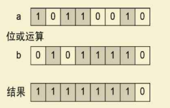
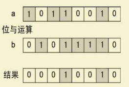
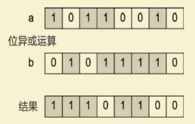

# 三、运算符

## 1.算数运算符

算术运算符用于组织整数类型和浮点类型的数据，有一元运算符和 二元运算符之分。

一元算术运算符有两个：+（正号）和-（负号），例如：+a还是a ，-a是对a的取反运算。 二元算术运算符如下表所示。

| 运算符 |   名称   | 例子 |           说明           |
| :----: | :------: | :--: | :----------------------: |
|   +    |    加    | a+b  |        求a与b的和        |
|   -    |    减    | a-b  |        求a与b的差        |
|   *    |    乘    | a*b  |        求a与b的积        |
|   /    |    除    | a/b  |       求a除以b的商       |
|   %    |   取余   | a%b  |      求a除以b的余数      |
|   **   |    幂    | a**b |       求a的b次方幂       |
|   //   | 地板除法 | a//b | 求小于a与b的商的最大整数 |

## 2.比较运算符

比较运算符用于比较两个表达式的大小，其结果是布尔类型的数据 ，即True或False。

| 运算符 |   名称   | 例子 |                说明                 |
| :----: | :------: | :--: | :---------------------------------: |
|   ==   |   等于   | a==b |   a等于b时返回True，否则返回False   |
|   !=   |  不等于  | a!=b |              与==相反               |
|   >    |   大于   | a>b  |   a大于b时返回True，否则返回False   |
|   <    |   小于   | a<b  |   a小于b时返回True，否则返回False   |
|   >=   | 大于等于 | a>=b | a大于等于b时返回True，否则返回False |
|   <=   | 小于等于 | a<=b | a小于等于b时返回True，否则返回False |

比较运算符可用于任意类型的数据，但参与比较的两种类型的数据要相互兼容，即==能进行隐式转换==。例如：整数、浮点和布尔这三种类型是相互兼容的。

比较字符串的大小，即逐一比较字符Unicode编码的大小，如果两个字符串的第一个字符不能比较出大小，则比较两字符串的第二个字符，直到比较有了结果才结束比较。

## 3.逻辑运算符

逻辑运算符用于对布尔型变量进行运算，其结果也是布尔型。

| 运算符 | 名称   | 例子    | 说明                                         |
| ------ | ------ | ------- | -------------------------------------------- |
| not    | 逻辑非 | not a   | a为True时，值为False，a为False时，值为True   |
| and    | 逻辑与 | a and b | a、b全为True时，计算结果为True，否则为False  |
| or     | 逻辑或 | a or b  | a、b全为False时，计算结果为False，否则为True |

Python也采用了“短路”设计。“短路”指“逻辑与”和“逻辑或”在计算过程中只要结果确定，则不再计算后面的表达式，从而提高效率，有点像电路短路。


```python
>>> a=1
>>> b=0
>>> def f1():
	print('--进入函数f1--')
	return True

>>> (a>b) or f1() #表达式(a>b)为True，结果确定为True，f1函数不会被调用
True
>>> (a<b) or f1() #表达式(a<b)为False，结果不确定，f1函数会被调用
--进入函数f1--
True
>>> (a<b) and f1() #表达式(a<b)为False，结果确定为False，f1函数不会被调用
False
>>> (a>b) and f1() #表达式(a>b)为True，结果不确定，f1函数会被调用
--进入函数f1--
True
>>> 
```

## 4.位运算符

位运算是以二进位（bit）为单位进行运算的，操作数和结果都是整 数类型的数据。

| 运算符 | 名称   | 例子   | 说明                           |
| ------ | ------ | ------ | ------------------------------ |
| ~      | 位反   | ~ x    | 将x的值按位取反                |
| &      | 位与   | x & y  | 将x与y按位进行位与计算         |
| \|     | 位或   | x \| y | 将x与y按位进行位或计算         |
| ^      | 位异或 | x ^ y  | 将x与y按位进行位异或计算       |
| >>     | 右移   | x >> a | 将x右移a位，高位采用符号位补位 |
| <<     | 左移   | x << a | 将x左移a位，地位用0补位        |

**a | b**



a和b按位进行或运算，只要有一位为1，这一位就为1，否则为0。

**a & b**



a和b按位进行与运算，只有两位全部为1，这一位才为1，否则为0。

**a ^ b**



a和b按位进行异或计算，只有两位相反时这一位才为1，否则为0。

**~ a**

在按位取反运算中涉及源码、补码、反码计算，比较麻烦。

归纳总计为一个公式：~ a = (a + 1) * -1，如果a为十进制数178，则~ a为十进制数-179；如果a为十进制数-33，则~ a为十进制数32。

## 5.赋值运算符

赋值运算符只是一种简写，只有算数运算和位运算中的二元运算符才有对应的赋值运算符。

| 运算符 | 名称         | 例子  | 说明         |
| ------ | ------------ | ----- | ------------ |
| +=     | 加赋值       | a+=b  | 等价于a=a+b  |
| -=     | 减赋值       | a-=b  | 等价于a=a-b  |
| *=     | 乘赋值       | a*=b  | 等价于a=a*b  |
| /=     | 除赋值       | a/=b  | 等价于a=a/b  |
| %=     | 取余赋值     | a%=b  | 等价于a=a%b  |
| **=    | 幂复制       | a**=b | 等价于a=a**b |
| //=    | 地板除法赋值 | a//=b | 等价于a=a//b |
| &=     | 位与赋值     | a&=b  | 等价于a=a&b  |
| \|=    | 位或赋值     | a\|=b | 等价于a=a\|b |
| ^=     | 位异或赋值   | a^=b  | 等价于a=a^b  |
| <<=    | 左移赋值     | a<<=b | 等价于a=a<<b |
| >>=    | 右移赋值     | a>>=b | 等价于a=a>>b |


## 6.运算符的优先级

算数运算符>关系运算符>赋值运算符

| 优先级 | 运算符                         | 说明                 |
| ------ | ------------------------------ | -------------------- |
| 1      | ()                             | 小括号               |
| 2      | **                             | 幂                   |
| 3      | ~                              | 位反                 |
| 4      | +,-                            | 正负号               |
| 5      | * , / , % , //                 | 乘、除、取余、地板除 |
| 6      | + , -                          | 加、减               |
| 7      | << , >>                        | 位移                 |
| 8      | &                              | 位与                 |
| 9      | ^                              | 位异或               |
| 10     | \|                             | 位或                 |
| 11     | < , <= , > , >= , <> , != , == | 比较                 |
| 12     | not                            | 逻辑非               |
| 13     | and , or                       | 逻辑与、逻辑或       |

在==位运算优先级==中，算数运算符>位运算符>关系运算符>逻辑运算符>赋值运算符。