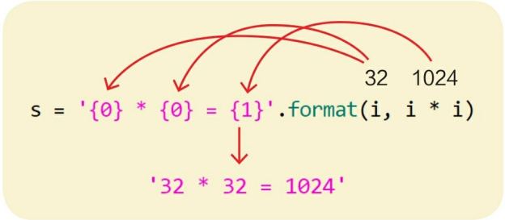
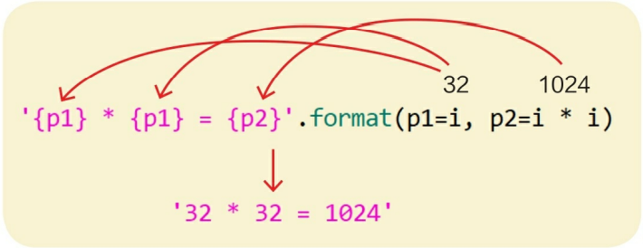
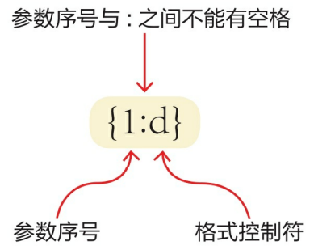

# 六、字符串

在python中，字符串(str)是一种不可变的字符序列。

## 1.字符串的表示方式

字符串有三种表示方式：普通字符串、原始字符串和长字符串。

### 1.1 普通字符串

普通字符串指用单引号(')或双引号(")括起来的字符串。

`'Hello'`或者`"World"`

*字符串本身包括单引号，可以使用双引号括起来，不需要转义*

*字符串本身包括双引号，可以使用单引号括起来，不需要转义*

如果需要在字符串中包含一些特殊的字符，例如换行符、制表符等，则需要进行转义，前面要加上反斜杠(`\`)，称作字符转义。

常见的转义符如下：

| 字符表示 | Unicode编码 |    说明    |
| :------: | :---------: | :--------: |
|    \t    |   \u0009    | 水平制表符 |
|    \n    |   \u000a    |    换行    |
|    \r    |   \u000d    |    回车    |
|   `\"`   |   \u0022    |   双引号   |
|   `\'`   |   \u0027    |   单引号   |
|   `\\`   |   \u005c    |   反斜线   |

### 1.2原始字符串

原始字符串中的特殊字符不需要被转义，按照字符串本来的样子呈现。在普通字符串前加r就是原始字符串了。

```python
>>> s = 'Hello\n World'
>>> print(s)
Hello
 World
>>> s = r'Hello\n World'
>>> print(s)
Hello\n World
>>> 
```

### 1.3长字符串

如果要使用字符串表示一篇文章，其中包含了换行、缩进等排版字符，则可以使用长字符串表示。对于长字符串，要使用三个单引号（'''）或三个双引号（＂＂＂）括起来。

```python
>>> s = """
        《早发白帝城》
朝辞白帝彩云间，千里江陵一日还。
两岸猿声啼不住，轻舟已过万重山。
"""
>>> print(s)

        《早发白帝城》
朝辞白帝彩云间，千里江陵一日还。
两岸猿声啼不住，轻舟已过万重山。

>>> 
```

## 2.字符串与数字的相互转换

### 2.1 将字符串转换为数字

将字符串转换为数字，可以使用int（）和float（）实现，如果成功则返回数字，否则引发异常。

```python
>>> int("80")
80
>>> int("80.0")
Traceback (most recent call last):
  File "<pyshell#22>", line 1, in <module>
    int("80.0")
ValueError: invalid literal for int() with base 10: '80.0'
>>> float("80.0")
80.0
>>> int("AB")
Traceback (most recent call last):
  File "<pyshell#24>", line 1, in <module>
    int("AB")
ValueError: invalid literal for int() with base 10: 'AB'
>>> int("AB",16) #按照十六进制转换"AB"
171
>>> 
```

**在默认情况下，int（）函数都将字符串参数当作十进制数字进行转换，所以int（'AB'）会失败。int（）函数也可以指定基数（进制）。**

### 2.2 将数字转换为字符串

将数字转换为字符串，可以使用**str（）**函数，**str（）**函数可以将很 多类型的数据都转换为字符串。

```python
>>> str(456321)
'456321'
>>> asd = 256413.0232412
>>> str(asd)
'256413.0232412'
>>> str(True)
'True'
>>> 
```

## 3.格式化字符串

字符串的**format（）**方法，它不仅可以实现字符串的拼接，还可以格式化字符串，例如在计算的金额需要保留小数点后四位，数字需要右对齐等，可以使用该方法。

### 3.1 使用占位符

要想将表达式的计算结果插入字符串中，则需要用到占位符。对于占位符，使用一对大括号（{}）表示。

```python
>>> i = 32
>>> s = 'i * i = {}'.format(i * i) #{}字符串占位符被format()方法中的参数替换
>>> s
'i * i = 1024'
>>> s = '{0} * {0} = {1}'.format(i,i * i) #在占位符中可以有参数序号，序号从0开始。
>>> s
'32 * 32 = 1024'
>>> s = '{p1} * {p1} = {p2}'.format(p1 = i,p2 = i * i) #在占位符中可以有参数名，p1和p2是在format()方法中设置的参数名
>>> s
'32 * 32 = 1024'
>>> 
```

默认占位符


参数序号占位符



参数名占位符



### 3.2 格式化控制符

格式化控制符位于占位符索引或占位符名字的后面，之间用冒号分隔，语法：{参数序号：格式控制符}或{参数名：格式控制符}。

| 格式化控制符 |              说明               |
| :----------: | :-----------------------------: |
|      s       |             字符串              |
|      d       |           十进制整数            |
|     f、F     |          十进制浮点数           |
|     g、G     |       十进制整数或浮点数        |
|     e、E     |      科学计算法表示浮点数       |
|      o       | 八进制整数，符号是小写英文字母o |
|     x、X     |          十六进制整数           |



代码示例:

```python
>>> money = 5834.5689
>>> name = 'tim'
>>> '{0:s}年龄{1:d},工资是{2:f}元。'.format(name,20,money)
'tim年龄20,工资是5834.568900元。'
>>> '{0}年龄{1},工资是{2:0.2f}元。'.format(name,20,money)
'tim年龄20,工资是5834.57元。'
>>> "{0}今天的收入是{1:G}元".format(name,money)
'tim今天的收入是5834.57元'
>>> "{0}今天的收入是{1:g}元".format(name,money)
'tim今天的收入是5834.57元'
>>> "{0}今天的收入是{1:e}元".format(name,money)
'tim今天的收入是5.834569e+03元'
>>> "{0}今天的收入是{1:E}元".format(name,money)
'tim今天的收入是5.834569E+03元'
>>> '十进制数{0:d}的八进制表示为{0:o}'.format(18)
'十进制数18的八进制表示为22'
>>> '十进制数{0:d}的八进制表示为{0:x}'.format(18)
'十进制数18的八进制表示为12'
>>> 
```

## 4.操作字符串

### 4.1 字符串查找

字符串的find（）方法用于查找子字符串。该方法的语法为str.find（sub[，start[，end]]），表示：在索引start到end之间查找子字符串sub，如果找到，则返回最左端位置的索引；如果没有找到，则返回-1。

**在python文档中[]表示可以省略部分内容，find()方法的参数[,start[,end]]表示start和end都可以省略。**

```python
>>> s_str = 'Hello World'
>>> s_str.find('e')
1
>>> s_str.find('l')
2
>>> s_str.find('i',4)
-1
>>> s_str.find('l',4)
9
>>> s_str.find('i',4,6)
-1
>>> 
```


### 4.2 字符串替换

若想进行字符串替换，则可以使用replace（）方法替换匹配的子字符串，返回值是替换之后的字符串。该方法的语法为**str.replace(old,new[，count])**，表示：用new子字符串替换old子字符串。count参数指定了替换old子字符串的个数，如果count被省略，则替换所有old子字符串。

```python
>>> text = 'AB CD EF GH IJ'
>>> text.replace(' ','|',2)
'AB|CD|EF GH IJ'
>>> text.replace(' ','|')
'AB|CD|EF|GH|IJ'
>>> text.replace(' ','|',1)
'AB|CD EF GH IJ'
>>> 
```

### 4.3 字符串分割

若想进行字符串分割，则可以使用split（）方法，按照子字符串来分割字符串，返回字符串列表对象。该方法的语法为**str.split(sep=None，maxsplit=-1)**，表示：使用sep子字符串分割字符串str。maxsplit是最大分割次数，如果maxsplit被省略，则表示不限制分割次数。

```python
>>> text = 'AB CD EF GH IJ'
>>> text.split(' ')
['AB', 'CD', 'EF', 'GH', 'IJ']
>>> text.split(' ',maxsplit=0)
['AB CD EF GH IJ']
>>> text.split(' ',maxsplit=1)
['AB', 'CD EF GH IJ']
>>> text.split(' ',maxsplit=2)
['AB', 'CD', 'EF GH IJ']
>>> 
```

## 5.统计英文文章中单词出现的频率

```python
# coding=utf-8
# 一篇文章文本
wordstring = """
it was the best of times it was the worst times.
it was the age of wisdom it was the age of foolishness.
"""
# 将标点符号替换
wordstring = wordstring.replace('.','')
# 分割单词
wordlist = wordstring.split()
wordfreq = []
for w in wordlist:
    # 统计单词出现的个数
    wordfreq.append(wordlist.count(w))

d = dict(zip(wordlist,wordfreq))
print(d)
```

结果：


