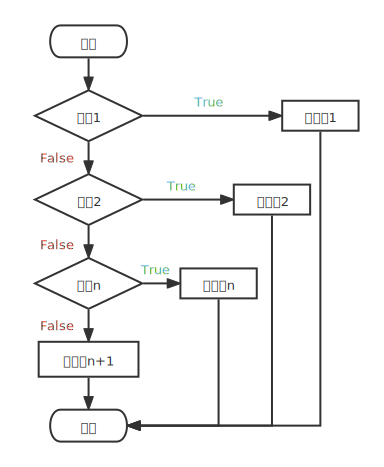
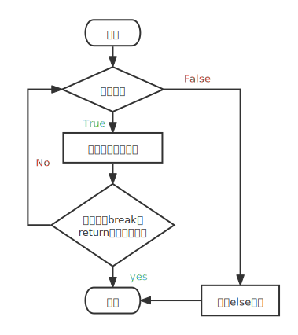
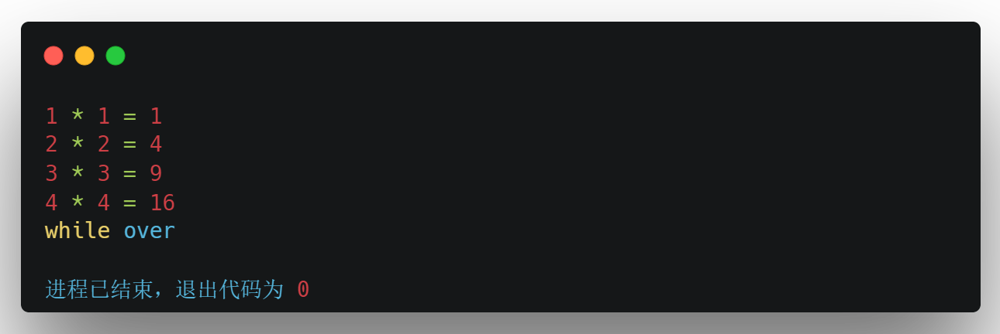
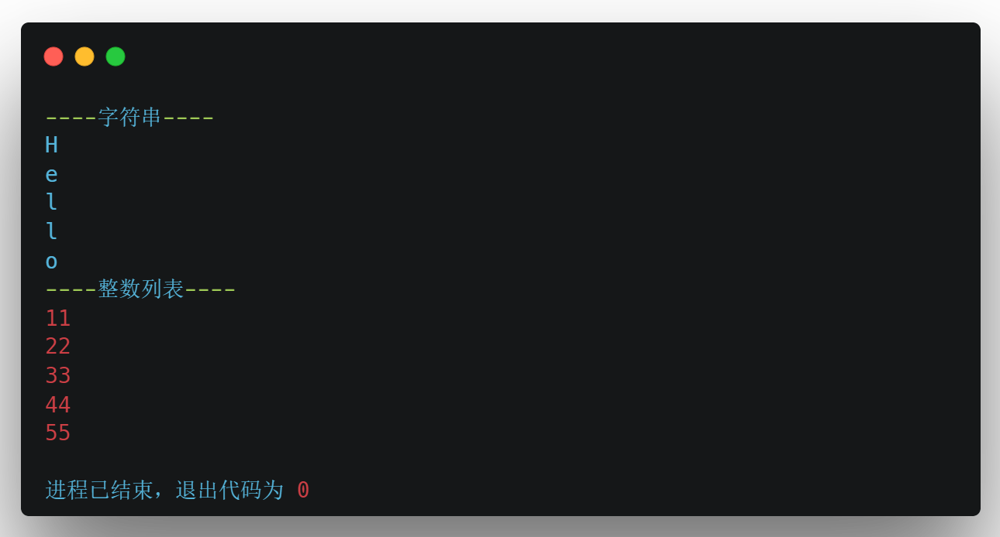
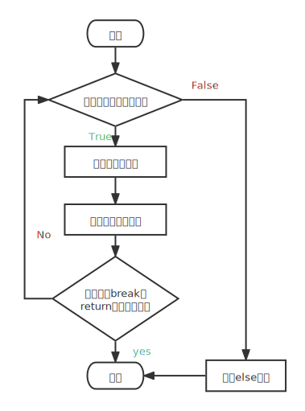
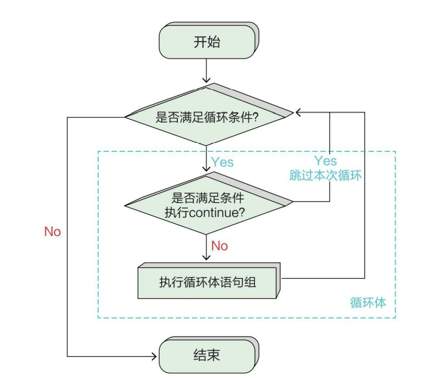
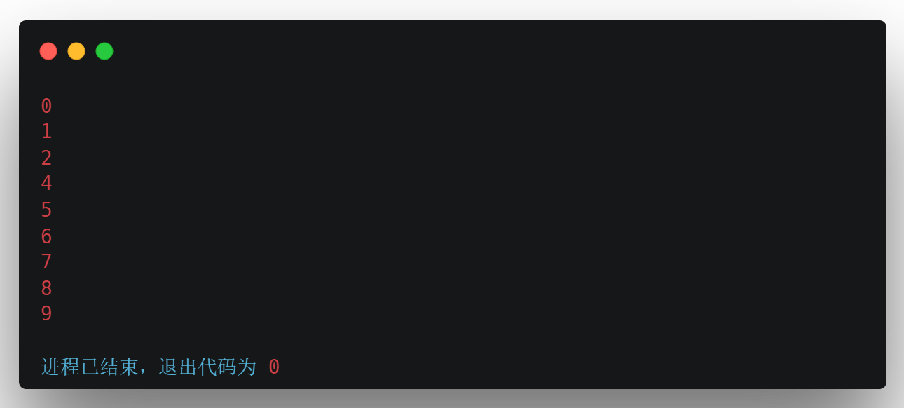

# 四、程序流程控制

## 1.条件语句

条件语句也被称为分支语句，许多编程语言都有判断语句if和多分支语句switch，在python中没有switch语句，多分支功能是通过if-elif-else实现的。

### if结构

`if`结构的语法如下：

```python
if 条件语句:
    语句组
```

代码实现：

```python
if score <  60:
    print("同志仍需努力！")
```

### if-else结构

`if-else`结构的语法如下：

```python
if 条件语句:
    语句组1
else:
    语句组2        
```

代码实现：

```python
if score >= 60:
    print("没挂科哦")
else:
    print("同志仍需努力")
```

###  if-elif-else结构

`if-elif-else`结构的语法如下：

```python
if 条件1:
    语句组1
elif 条件2:
    语句组2
    ...
elif 条件n:
    语句组n
else:
    语句组n+1
```



代码实现：

```python
# coding=utf-8
score = int(input("请输入一个整数："))

if score >= 90:
    grade = 'A'
elif score >= 80:
    grade = 'B'
elif score >= 70:
    grade = 'C'
elif score >= 60:
    grade = 'D'
else:
    grade = 'E'
    
print("Grade = " + grade)
```

## 2.循环语句

Python支持两种循环语句：`while`和`for`。

### while语句

在python中只有`while`语句，没有`do-while`语句。`while`语句先判断循环条件，若条件为`True`则执行循环体。

while语句的语法：

```python
while 循环条件:
    循环体语句组
[else:
    语句组] #中括号部分可以省略
```

代码实现：

```python
# coding=utf-8
i = 0
while i * i < 1000:
    i += 1
    
print("i =" + str(i))
print("i * i=" + str(i * i))
```

结果：


`else`子语句是在循环体正常结束时才执行的语句，当循环被中断时不执行，当遇到`break`、`return`和有异常发生时都会中断循环。



代码实现：

```python
# coding=utf-8
i = 0
while i * i <10:
    i += 1
    print(str(i) + ' * ' + str(i) + ' =',i * i)
    # str()函数可以将其他数据类型转换为字符串
else: #while循环体没有中断，执行else语句
    print('while over')
```



当`while`语句被`break`中断时，则不会执行`else`语句。

```python
# coding=utf-8
i = 0
while i * i <10:
    i += 1
    if i == 3:
        break
    print(str(i) + ' * ' + str(i) + ' =',i * i)
else: #while循环体被中断，不会执行else语句
    print('while over')
```


### for语句

基于简单的设计理念，在python中只有一种for语句，即`for-in`语句，它可以遍历任何可迭代对象中的元素。

> 可迭代对象包括字符串、列表、元组、集合和字典等。

for语句的格式如下：

```python
for 变量 in 可迭代对象:
    循环体语句组
[else:
    语句组] #中括号部分可以省略
```

代码实现：

```python
# coding=utf-8
print("----字符串----")
for item in 'Hello':
    print(item)
# 声明整数列表
numbers = [11,22,33,44,55]
print("----整数列表----")
for item in numbers:
    print(item)
```



`for`语句中的`else`子语句与`while`语句中的else子语句作用是一样的, 在循环体正常结束时才执行`else`语句，在循环被中断时不执行，在遇到`break`、`return`和有异常发生时都会中断循环。



代码实现：

```python
#coding=utf-8
for item in range(10):
    if item == 3:
        break
    print(item)
else:
    print('for over')
```


## 3.跳转语句

跳转语句能够改变程序的执行顺序，包括break、continue和return。 break和continue用于循环体中，而return用于函数中。

### break语句

break语句用于强行退出循环体，不再执行循环体中剩余的语句。


代码实现：

```python
# coding=utf-8
for item in range(10):
    if item == 3:
        # 跳出循环
        break
    print(item)
```


### continue语句

continue语句用于结束本次循环，跳过循环体中尚未执行的语句， 接着进行终止条件的判断，以决定是否继续循环。



代码实现：

```python
# coding=utf-8
for item in range(10):
    if item == 3:
        continue
    print(item)
```



注意：在输出结果中没有3。

## 4.计算水仙花数

水仙花数是一个三位数，三位数各位的立方之和等于三位数本身。

```python
# coding=utf-8
i = 100; b = 0; s = 0; g = 0
while i < 1000:
    b = i // 100
    s = (i - b * 100)//10
    g = i - b * 100 -s * 10
    if (b ** 3 + s ** 3 + g ** 3)== i:
        print(str(i))
    i += 1
```


